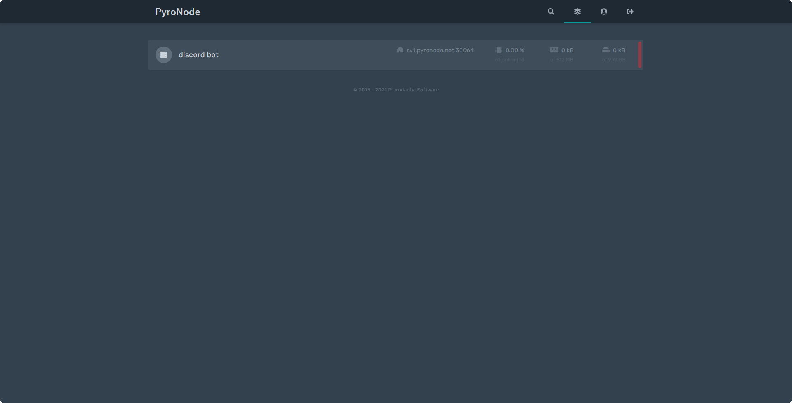

# Discord Bot

## Empezar a usar el hosting

Para empezar a utilizar tu servicio de Discord Bot Hosting puedes o **programar el propio bot** a través de nuestro panel, o **subir tus archivos** ya creados al servidor.

### Configuración de cuenta

Al solicitar tu primer servicio con nuestro panel, te llegará un correo para la configuración de tu cuenta. Debes acceder al enlace que el correo proporciona para establecer una contraseña en tu cuenta.

## Acceder al servidor

Acceder al servidor es tan sencillo como entrar en [nuestro panel](https://panel.pyronode.com) y el servidor al que desees entrar.

## Subir los archivos

### A través del File manager integrado

Una vez dentro del servidor, deberás ir a la pestaña de `File Manager`.

Dentro de ese apartado tienes varias formas para subir tus archivos:

* Comprimir tus archivos en un **.zip**, subirlo al panel y descomprimirlo. _**\(recomendado\)**_
* Subir cada archivo manualmente.

### A través de SFTP

En la pestaña de `Settings` se muestran unos datos de acceso para el SFTP. Además se encuentra un botón para lanzar directamente una conexión al servidor en caso de tener un programa instalado que lo permita.


La contraseña del SFTP es la misma que tu usuario del panel.


